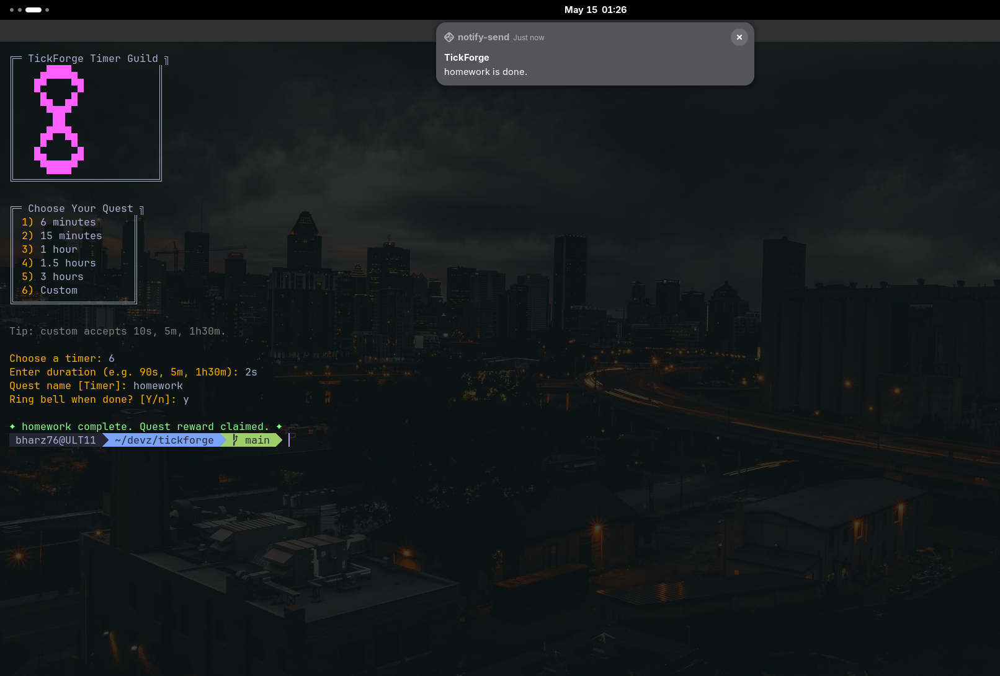
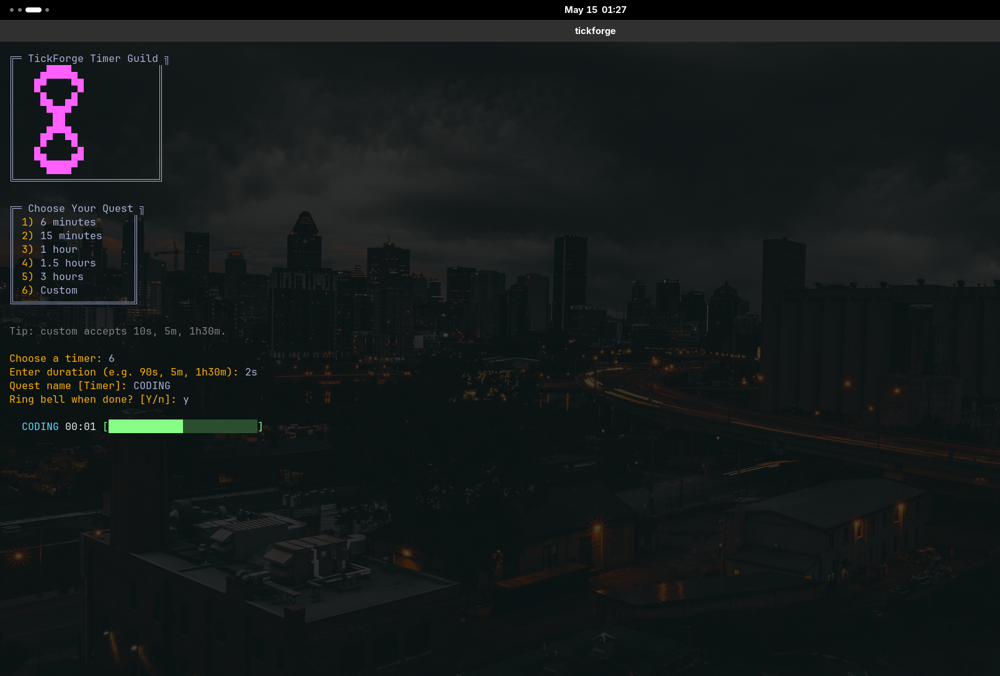

# TickForge

Tiny RPG-ish terminal timer for quick focus sessions.



## Features

- Interactive pixel-art menu
- Presets for `6m`, `15m`, `1h`, `1h30m`, and `3h`
- Custom timers like `10s`, `5m`, or `1h30m`
- Desktop notification when the timer ends
- Stopwatch and Pomodoro modes

## Install

```bash
cd ~/devz/tickforge
python -m pip install -e .
```

## Usage

```bash
tickforge
```

```bash
tickforge 10s
tickforge 5m --label Focus
tickforge stopwatch
tickforge pomodoro --work 25m --break-time 5m --cycles 4
```

## Notification



## Controls

- `Ctrl+C` stops the timer.
- `--quiet` disables the bell.
